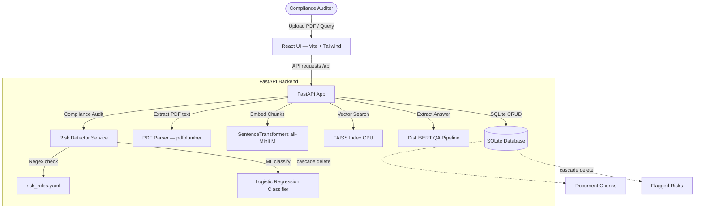
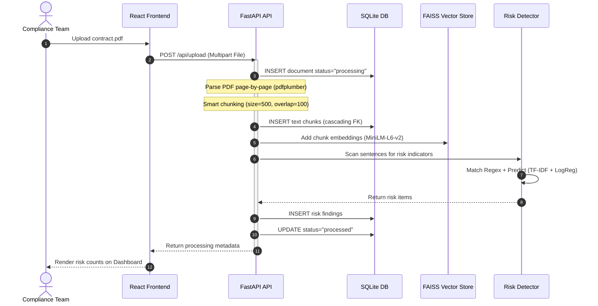
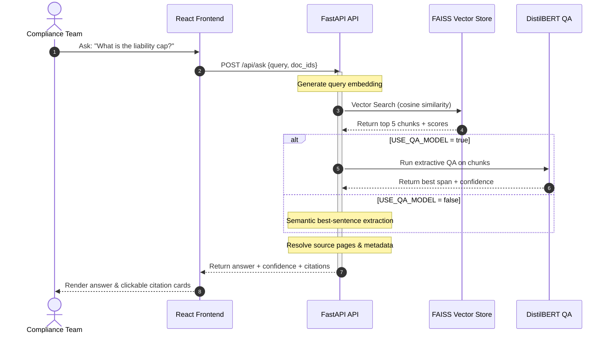

# Multi-Document QA & Risk Detection System

A production-grade compliance document scanner and question answering platform. Upload PDF contracts, policies, and SOPs — automatically detect risks, ask natural-language questions, and get answers with page-level citations.

---

## System Architecture



---

## Tech Stack

| Layer | Technology |
| :--- | :--- |
| **Backend** | FastAPI, Python 3.11+, Pydantic, Uvicorn |
| **NLP** | SentenceTransformers (all-MiniLM-L6-v2), DistilBERT QA, TF-IDF + LogReg |
| **Vector DB** | FAISS (CPU) with NumPy fallback |
| **PDF Processing** | pdfplumber |
| **Frontend** | React 19, Vite 8, Tailwind CSS 3, Recharts, Lucide React |
| **Storage** | SQLite |
| **Deployment** | Docker, Docker Compose |

---

## Database Schema

### `documents`
| Column | Type | Description |
| :--- | :--- | :--- |
| `id` | TEXT PK | UUID generated on upload |
| `filename` | TEXT | Original filename |
| `upload_time` | TEXT | ISO-8601 UTC timestamp |
| `status` | TEXT | `processing`, `processed`, `failed` |
| `filepath` | TEXT | Stored PDF file path |

### `chunks`
| Column | Type | Description |
| :--- | :--- | :--- |
| `id` | TEXT PK | Unique chunk ID |
| `doc_id` | TEXT FK → documents(id) CASCADE | Parent document |
| `page_num` | INTEGER | 1-indexed PDF page |
| `text` | TEXT | Chunk text content |

### `risks`
| Column | Type | Description |
| :--- | :--- | :--- |
| `id` | TEXT PK | Unique risk ID |
| `doc_id` | TEXT FK → documents(id) CASCADE | Parent document |
| `risk_type` | TEXT | Rule ID or ML classification |
| `severity` | TEXT | `HIGH`, `MEDIUM`, `LOW` |
| `page_num` | INTEGER | 1-indexed PDF page |
| `text` | TEXT | Matched clause text |
| `confidence` | REAL | Classification confidence |
| `classification_method` | TEXT | `rule` or `ml` |

---

## Sequence Diagrams

### PDF Processing Pipeline



### RAG Question Answering



---

## API Endpoints

| Method | Endpoint | Description |
| :--- | :--- | :--- |
| `POST` | `/api/upload` | Upload single or multiple PDFs |
| `POST` | `/api/ask` | RAG-based question answering |
| `POST` | `/api/detect-risk` | On-demand risk assessment |
| `GET` | `/api/documents` | List all indexed documents |
| `DELETE` | `/api/documents/{id}` | Delete a document |
| `GET` | `/api/risks` | List flagged risks (filterable) |
| `GET` | `/api/health` | System health diagnostics |

---

## Project Structure

```
backend/
├── app/
│   ├── api/
│   │   └── endpoints.py         # REST API routes
│   ├── services/
│   │   ├── database.py          # SQLite manager
│   │   ├── document_processor.py # PDF parsing & chunking
│   │   ├── vector_store.py      # FAISS embeddings
│   │   ├── qa_service.py        # DistilBERT QA + best-span
│   │   ├── risk_detector.py     # Rule + ML risk detection
│   │   ├── train_risk_model.py  # Model training script
│   │   ├── save_model.py        # CLI training wrapper
│   │   └── predict_risk.py      # CLI inference wrapper
│   ├── models/
│   │   └── risk_classifier.pkl  # Trained model (generated)
│   └── main.py                  # FastAPI entry point
├── tests/
│   └── test_backend.py          # Unit & integration tests
├── risk_rules.yaml              # Compliance rules
├── requirements.txt
└── Dockerfile

frontend/
├── src/
│   ├── pages/
│   │   ├── Dashboard.jsx        # Analytics dashboard
│   │   ├── QA.jsx               # Question answering UI
│   │   └── RiskExplorer.jsx     # Risk audit panel
│   ├── services/
│   │   └── api.js               # API client
│   ├── App.jsx                  # Navigation shell
│   ├── index.css                # Glassmorphic design system
│   └── main.jsx                 # React entry point
├── tailwind.config.js
├── postcss.config.js
└── package.json

scripts/
└── generate_sample_pdfs.py      # Sample PDF generator

docker-compose.yml
```

---

## Installation & Setup

### Option 1: Docker Compose (Recommended)

```bash
docker-compose up --build
```
- Frontend: http://localhost:3000
- Backend: http://localhost:8000
- API Docs: http://localhost:8000/docs

### Option 2: Local Development

#### Backend Setup
```bash
cd backend
python -m venv .venv

# Windows:
.venv\Scripts\activate

# Linux/Mac:
source .venv/bin/activate

pip install -r requirements.txt
python -c "from app.services.train_risk_model import train_and_save_model; train_and_save_model()"
uvicorn app.main:app --reload --port 8000
```

#### Generate Sample PDFs
```bash
python scripts/generate_sample_pdfs.py
```

#### Frontend Setup
```bash
cd frontend
npm install
npm run dev
```
Open http://localhost:5173

---

## Testing

```bash
# From project root (Windows)
cd backend
$env:PYTHONPATH="."; .\.venv\Scripts\python.exe -m pytest tests/ -v

# Linux/Mac
cd backend
PYTHONPATH=. python -m pytest tests/ -v
```

---

## Environment Variables

| Variable | Default | Description |
| :--- | :--- | :--- |
| `USE_QA_MODEL` | `true` | Use DistilBERT QA model. Set to `false` for best-span fallback. |

---

## Performance

| Metric | Target |
| :--- | :--- |
| PDF Processing | < 5 sec/document |
| Vector Retrieval | < 500 ms |
| Answer Generation | < 2 sec |
| Risk Detection | < 1 sec/document |
| Memory Usage | < 4GB RAM |
